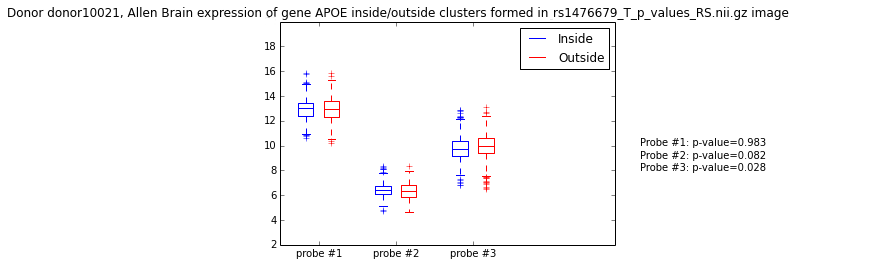

# AllenBrainPy
Python package to analyze Allen Human Brain genes expression

 

## Installation

Navigate to directory where you want to save this package and clone this repository:
     ```
     git clone https://github.com/roshchupkin/AllenBrainPy.git
     ```
## Download Allen Human Brain Atlas data
Make two directories in your project folder, one for `MRI data` and for `expression data`. 
In `config.py` script change **DATA_DIR** to path to expression directory and **MRI_DIR** to path to MRI directory. 
### Expression Data
You can download data from [Allen Brain Institute](http://human.brain-map.org/static/download) 
or from this dropbox [link](https://www.dropbox.com/sh/uzwgv320pce1h0a/AAASsTOMSpfKOLe5ZZSMoFlca?dl=0). 
Save all csv table in separate folder for every donor in your `expression directory`.
### MRI data
Original MRI T1 images were transformed to template MNI space. You can download find all transformed image
 and template from this [link](https://www.dropbox.com/sh/uzwgv320pce1h0a/AAASsTOMSpfKOLe5ZZSMoFlca?dl=0). Save all of them in your `MRI directory`.
## Update

You can update to the newest version using `git`. Navigate to your folder (where you cloned git repository):    
     ```
     git pull
     ```
     
## Usage

```
Python script to analyze VBM results and Allen Human Brain Atlas of gene
expression

optional arguments:
  -h, --help            show this help message and exit
  -o O                  path to save result folder
  -model {cluster_expression,correlation}
                        Analysis models
  -i I                  path input nifti image of VBM result map
  -d {all,caucasian}    choose all donors or only caucasian
                        (choices=['all','caucasian'])
  -donor DONOR [DONOR ...]
                        choose donor(s)
  -threshold THRESHOLD  value threshold to form clusters from VBM result map
  -cl_size_threshold CL_SIZE_THRESHOLD
                        cluster size threshold to form clusters from VBM
                        result map
  -dist_threshold DIST_THRESHOLD
                        threshold for distance in voxels to link sample to
                        clusters
  -map_type {p-value,t-stat}
                        Type of VBM result map. For p-value clusters will be
                        formed for voxels < threshold,for t-stat clusters will
                        be formed for voxels > threshold, therefore first
                        split your image to negative and positive t-stat,save
                        as two maps with abs values and then run analysis
                        separately for both images.You can easily extrapolate
                        these two map types to any other result map.
  -result_name RESULT_NAME
                        name for saving results
  -probe_mode {all,best,mean}
                        gene name for expression analysis
  -plot                 plot boxplot of gene expression
  -gene_names GENE_NAMES [GENE_NAMES ...]
                        gene name for expression analysis

```
## Citation 

[G.Roshchupkin et al. Effect of Alzheimer Disease risk loci on brain morphology through modulation of gene expression. 
HBM, Annual Meeting of the Organization for Human Brain Mapping, 2016.](https://ww5.aievolution.com/hbm1601/index.cfm?do=abs.viewAbs&abs=3280) 
